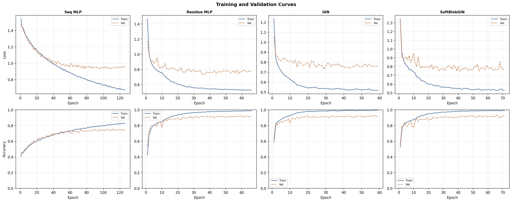
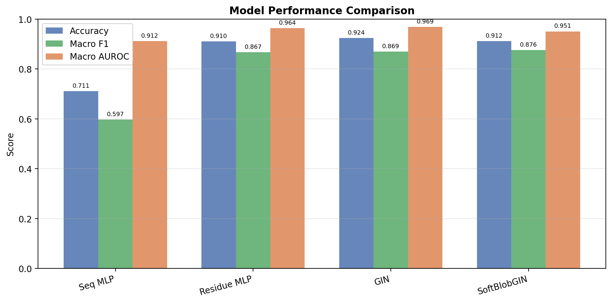
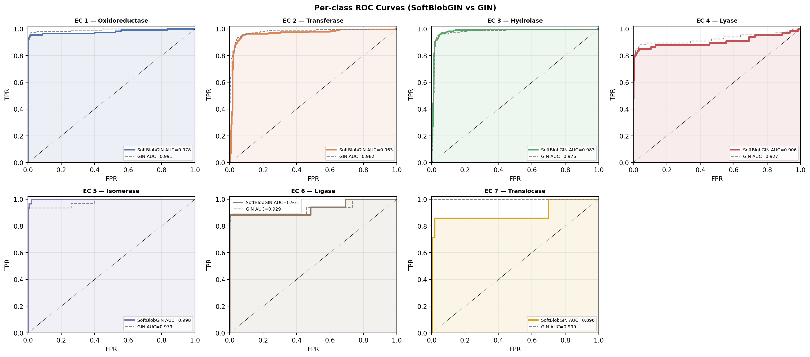

# Does Protein Structural Representation Matter for Enzyme Function Prediction?

**CE7412 Computational and Systems Biology — Course Project (2026)**

> A systematic comparison of four protein representations on the Enzyme Commission
> (EC) multi-class classification task, featuring a novel **SoftBlobGIN** architecture
> that combines Graph Isomorphism Networks with BioBlobs-inspired differentiable
> substructure pooling, powered by ESM-2 protein language model embeddings.

## Authors

- Dutta Siddhant Shivshankar
- Soumick Sarkar
- Edward Tan Beng Wai
- Rangodage Mendis Gunawardana Kavindu Pasan Kumara

Nanyang Technological University, Singapore

---

## Results

### Main Results (all 15,603 proteins, 14,042 train / 780 val / 781 test)

| Model | Test Acc | Macro F1 | Macro AUROC | Params | Train Time |
|-------|----------|----------|-------------|--------|------------|
| Seq MLP | 0.711 | 0.597 | 0.912 | 140K | 54s |
| Residue MLP | 0.910 | 0.867 | 0.964 | 1.2M | 32s |
| GIN | 0.925 | 0.869 | 0.969 | 1.4M | 15 min |
| SoftBlobGIN | 0.912 | 0.876 | 0.951 | 1.1M | 27 min |
| **Ensemble (5×SoftBlobGIN)** | **0.928** | **0.898** | **0.955** | — | — |

### Feature Ablation (GIN model)

| Feature Set | Dims | Accuracy | Macro F1 |
|-------------|------|----------|----------|
| One-hot only | 20 | 0.752 | 0.624 |
| + Physicochemical + SASA | 38 | 0.722 | 0.653 |
| + ESM-2 (1280-dim) | 1318 | 0.909 | 0.853 |
| Full (all features + edges) | 1318 | 0.913 | 0.846 |

**Key finding**: ESM-2 protein language model embeddings account for ~85% of the total improvement, jumping macro-F1 from 0.65 to 0.85 in a single change.

---

## Project Structure

```
enzyme-classification/
├── configs/
│   ├── default.yaml                # Base configuration
│   └── full_power.yaml             # Full-data config (used for final results)
├── scripts/
│   ├── extract_esm_embeddings.py   # One-time ESM-2 feature extraction
│   ├── train.py                    # Main training pipeline (all 4 models)
│   ├── ablation.py                 # Ablation studies (eps, blobs, features)
│   └── ensemble.py                 # Multi-seed ensemble
├── src/
│   ├── data/
│   │   ├── features.py             # Feature engineering (ESM-2, physicochemical, edge)
│   │   ├── dataset.py              # ProteinShake loading, graph construction, splits
│   │   └── augmentation.py         # Training-time graph augmentation
│   ├── models/
│   │   ├── modules.py              # Shared: MultiPool, ClusterAttention, GateFusion
│   │   ├── seq_mlp.py              # Model 1: AA composition MLP
│   │   ├── residue_mlp.py          # Model 2: Mean-pooled feature MLP
│   │   ├── gat.py                  # Model: GATv2 graph classifier (alternative)
│   │   ├── gin.py                  # Model 3 & 4: GIN + SoftBlobGIN (primary)
│   │   └── soft_blob_gat.py        # Model: SoftBlobGAT (alternative)
│   ├── training/
│   │   ├── losses.py               # Focal loss, label smoothing
│   │   └── trainer.py              # Training loop, early stopping, checkpointing
│   ├── evaluation/
│   │   └── metrics.py              # Accuracy, F1, AUROC, confusion matrix
│   └── visualization/
│       └── plots.py                # All report figures
├── requirements.txt
└── README.md
```

---

## Setup & Installation

### Prerequisites

- Python 3.11
- CUDA-capable GPU (tested on NVIDIA RTX 6000 Ada, 48GB VRAM)
- ~5 GB disk space (dataset + ESM-2 model + cached embeddings)

### Step 1: Create conda environment

```bash
conda create -n enzyme python=3.11 -y
conda activate enzyme
```

### Step 2: Install PyTorch with CUDA

Check your CUDA version with `nvidia-smi`, then install the matching PyTorch:

```bash
# For CUDA 12.1 (most common)
pip install torch torchvision --index-url https://download.pytorch.org/whl/cu121

# For CUDA 11.8
# pip install torch torchvision --index-url https://download.pytorch.org/whl/cu118
```

### Step 3: Install PyTorch Geometric

```bash
# Get your exact PyTorch version
TORCH_VERSION=$(python -c "import torch; print(torch.__version__)")

# Install sparse backends
pip install torch-scatter torch-sparse -f https://data.pyg.org/whl/torch-${TORCH_VERSION}.html

# Install PyG
pip install torch-geometric
```

If the wheel isn't found, build from source:
```bash
pip install torch-scatter torch-sparse --no-build-isolation
pip install torch-geometric
```

### Step 4: Install remaining dependencies

```bash
pip install -r requirements.txt
```

### Step 5: Verify installation

```bash
python -c "import torch; print(f'PyTorch {torch.__version__}, CUDA: {torch.cuda.is_available()}, GPU: {torch.cuda.get_device_name(0)}')"
python -c "from torch_geometric.nn import GINEConv; print('PyG OK')"
python -c "import esm; print('ESM OK')"
```

Expected output:
```
PyTorch 2.x.x+cu121, CUDA: True, GPU: NVIDIA RTX 6000 Ada Generation
PyG OK
ESM OK
```

---

## Reproducing Results

### Full pipeline (recommended)

This reproduces the exact results reported above. Total time: ~4-5 hours on an RTX 6000-class GPU.

```bash
# 1. Extract ESM-2 (650M) embeddings — one-time, ~30-60 min
#    Downloads the ESM-2 model (~2.5 GB) and extracts 1280-dim
#    per-residue embeddings for all 15,603 proteins.
#    Cached to data/esm_cache_650M/ — never needs to run again.
python scripts/extract_esm_embeddings.py --config configs/full_power.yaml --batch-size 4

# 2. Train all 4 models — ~45 min
#    Trains Seq MLP, Residue MLP, GIN, SoftBlobGIN.
#    Saves best checkpoints, all figures, and metrics CSVs.
python scripts/train.py --config configs/full_power.yaml

# 3. Run ablation studies — ~2-3 hours
#    Tests contact radius (4/8/12 Å), blob count (3/5/8/12),
#    and feature sets (onehot → +physico → +ESM-2 → full).
python scripts/ablation.py --config configs/full_power.yaml

# 4. Ensemble — ~2 hours
#    Trains 5× SoftBlobGIN with different seeds,
#    averages softmax predictions for final result.
python scripts/ensemble.py --config configs/full_power.yaml --n-seeds 5
```

### Quick test run (~10 min, CPU-friendly)

To verify everything works before committing to the full run:

```bash
python scripts/train.py --quick
```

This caps training at 50 epochs and 250 samples/class.




### View training logs

```bash
# TensorBoard (loss, accuracy, learning rate curves)
tensorboard --logdir outputs_full/logs/tensorboard

# Raw training log
cat outputs_full/logs/training.log
```

---

## Using Pretrained Models

Best model checkpoints are saved in `outputs_full/checkpoints/`. To load and run inference:

```python
import torch
import yaml
from src.models.gin import GINModel, SoftBlobGIN
from src.data.dataset import EnzymeDataset
from src.training.trainer import predict_pyg

# Load config and dataset
with open("configs/full_power.yaml") as f:
    cfg = yaml.safe_load(f)
dataset = EnzymeDataset(cfg).prepare()

# Load pretrained GIN
device = torch.device("cuda" if torch.cuda.is_available() else "cpu")
model = GINModel(
    in_ch=dataset.feat_dim, hidden=256, n_classes=7,
    edge_dim=dataset.edge_dim, n_layers=4, dropout=0.3
).to(device)
model.load_state_dict(
    torch.load("outputs_full/checkpoints/GIN_best.pt", map_location=device)
)

# Run inference on test set
y_true, y_pred, y_prob = predict_pyg(model, dataset.test_loader, device)
print(f"Accuracy: {(y_true == y_pred).mean():.4f}")

# Or load SoftBlobGIN
blob_model = SoftBlobGIN(
    in_ch=dataset.feat_dim, hidden=256, n_classes=7,
    edge_dim=dataset.edge_dim, n_blobs=8, n_layers=4, dropout=0.3
).to(device)
blob_model.load_state_dict(
    torch.load("outputs_full/checkpoints/SoftBlobGIN_best.pt", map_location=device)
)
```

---

## Output Files

After running the full pipeline, the following files are generated:

### Metrics (`outputs_full/`)
| File | Description |
|------|-------------|
| `model_comparison.csv` | Main results: accuracy, F1, AUROC for all models |
| `per_class_metrics_*.csv` | Per-EC precision, recall, F1 for each model |
| `ensemble_result.csv` | Ensemble accuracy, F1, AUROC |
| `ensemble_individual.csv` | Per-seed individual model metrics |
| `ablation_eps.csv` | Contact radius ablation results |
| `ablation_blobs.csv` | Blob count ablation results |
| `ablation_features.csv` | Feature set ablation results |

### Figures (`outputs_full/figures/`)
| Figure | Description |
|--------|-------------|
| `fig_class_distribution.png` | EC class counts across train/val/test splits |
| `fig_aa_composition.png` | Amino acid composition heatmap per EC class |
| `fig_training_curves.png` | Loss and accuracy curves for all 4 models |
| `fig_confusion_matrices.png` | Normalized confusion matrices (all models) |
| `fig_roc_curves.png` | Per-class ROC curves (GIN vs SoftBlobGIN) |
| `fig_model_comparison.png` | Bar chart comparing accuracy, F1, AUROC |
| `fig_embeddings.png` | t-SNE and UMAP of test-set graph embeddings |
| `fig_ablation_eps.png` | Contact radius ablation plot |
| `fig_ablation_blobs.png` | Blob count ablation plot |
| `fig_ablation_features.png` | Feature set ablation plot |

### Checkpoints (`outputs_full/checkpoints/`)
| File | Description |
|------|-------------|
| `SeqMLP_best.pt` | Best Seq MLP weights |
| `ResidueMLP_best.pt` | Best Residue MLP weights |
| `GIN_best.pt` | Best GIN weights |
| `SoftBlobGIN_best.pt` | Best SoftBlobGIN weights |

---

## Key Contributions

1. **ESM-2 protein language model features**: 1280-dim per-residue embeddings from the 650M-parameter ESM-2 model, combined with physicochemical properties (hydrophobicity, charge, volume, flexibility) and solvent accessibility (SASA/RSA) for a 1318-dim feature vector per residue.

2. **Graph Isomorphism Network (GIN) with edge features**: GINEConv with RBF-encoded Cα-Cα distances (16 Gaussian bins) and sequence separation as edge features, plus JumpingKnowledge aggregation across all layers. GIN is provably the most expressive message-passing GNN for graph classification under the Weisfeiler-Leman isomorphism test.

3. **SoftBlobGIN**: A lightweight adaptive graph partitioning method inspired by BioBlobs (Wang & Oliver, 2025). Uses Gumbel-softmax blob assignment with temperature annealing to learn variable-size protein substructures, followed by max-pool aggregation over blob embeddings concatenated with a global mean-pool embedding. Achieves competitive performance with built-in interpretability of which residues group together.

4. **Comprehensive ablation studies**: Contact radius (4/8/12 Å), blob count (3/5/8/12), and feature set ablations cleanly isolate the contribution of each component — revealing that ESM-2 embeddings account for ~85% of the total improvement.

5. **Training innovations**: Focal loss with γ=1.0 for class imbalance (EC7 has only 139 training samples), cosine annealing with linear warmup, graph augmentation (edge drop + feature masking), and 5-seed ensemble averaging.

---

## Dataset

[ProteinShake EnzymeClassTask](https://proteinshake.ai/): 15,603 PDB structures annotated with Enzyme Commission numbers (EC 1–7), with AlphaFold-predicted residue graphs. Split using a strict sequence-similarity threshold of θ=0.7 to prevent data leakage.

| EC Class | Name | Train | Val | Test |
|----------|------|-------|-----|------|
| EC 1 | Oxidoreductase | 2,099 | 118 | 115 |
| EC 2 | Transferase | 4,089 | 230 | 248 |
| EC 3 | Hydrolase | 5,619 | 303 | 296 |
| EC 4 | Lyase | 972 | 55 | 67 |
| EC 5 | Isomerase | 646 | 32 | 31 |
| EC 6 | Ligase | 478 | 34 | 17 |
| EC 7 | Translocase | 139 | 8 | 7 |

---

## Model Hierarchy

| Model | Input | Architecture | Structural Info | Purpose |
|-------|-------|-------------|-----------------|---------|
| **Seq MLP** | AA composition (20-dim) | 3-layer MLP | None | Baseline: sequence only |
| **Residue MLP** | Mean-pooled features (1318-dim) | 3-layer MLP | None (features only) | Tests ESM-2 without topology |
| **GIN** | Contact graph + 1318-dim nodes + 18-dim edges | 4-layer GINEConv + JK + dual pool | Fixed ε-radius | Best single-model accuracy |
| **SoftBlobGIN** | Contact graph + 1318-dim nodes + 18-dim edges | GIN + Gumbel blob pool | Learned adaptive | Interpretable substructures |

---

## Configuration

All hyperparameters are in `configs/full_power.yaml`. Key settings:

```yaml
features:
  use_esm2: true
  esm2_model: "esm2_t33_650M_UR50D"   # 650M-param protein language model
  esm2_dim: 1280                        # per-residue embedding dimension
  use_physicochemical: true             # hydrophobicity, charge, volume, etc.
  use_sasa: true                        # solvent accessible surface area
  use_edge_distance: true               # RBF-encoded Cα-Cα distances
  rbf_centers: 16                       # Gaussian bins for distance encoding

models:
  gin:
    hidden: 256
    n_layers: 4                         # GINEConv layers with JumpingKnowledge
  soft_blob_gin:
    hidden: 256
    n_blobs: 8                          # learnable protein substructures
    tau_start: 1.0                      # Gumbel-softmax temperature annealing
    tau_end: 0.1

training:
  loss: "focal"                         # handles severe class imbalance
  focal_gamma: 1.0
  scheduler: "cosine_warmup"
  augmentation:
    edge_drop_rate: 0.05                # structural regularization
    feature_mask_rate: 0.05             # feature regularization
```

---

## References

1. Wang, X. & Oliver, C. (2025). *BioBlobs: Differentiable graph partitioning for protein representation learning.* arXiv:2510.01632.
2. Xu, K. et al. (2019). *How powerful are graph neural networks?* ICLR 2019.
3. Lin, Z. et al. (2023). *Evolutionary-scale prediction of atomic-level protein structure with a language model.* Science.
4. Kucera, T. et al. (2023). *ProteinShake: Building datasets and benchmarks for deep learning on protein structures.* NeurIPS.
5. Lin, T.-Y. et al. (2017). *Focal loss for dense object detection.* ICCV.

---

## License

This project is licensed under the [MIT License](LICENSE).
